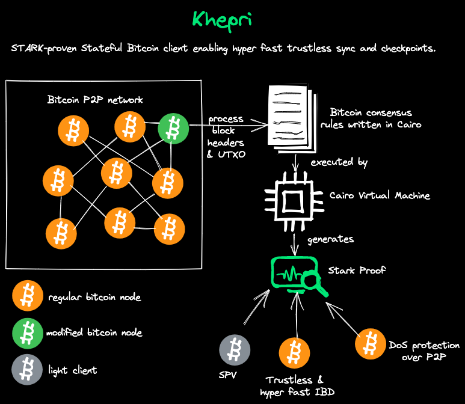

# Khepri

STARK-proven Stateful Bitcoin client enabling hyper fast trustless sync and checkpoints.

## Architecture



## Description

The idea of Khepri is to leverage Stark proof system in order to solve some issues in Bitcoin ecosystem or at least enhance the user experience.

With Stark proofs and Cairo, we have the ability to verify the integrity of a computation without having to naively redo all computation. Hence a verifier can be sure of the honest execution of a program, without the need of executing it and check the result.

The verification of the proof is exponentially faster than the naive execution of the program, which provide scalability.

Moreover, the overhead of generating the proof is negligible compared to the normal execution without the generation of the proof.

This mechanism can enable a lot of potential optimizations on several use cases.

What kind of problems can we solve with this super power ? Well, there are so many issues we could imagine to tackle with this approach, here are some cool features that could be enabled with this system:

- hyper fast & trustless synchronization (IBD)
- enhanced Simplified Payment Verification
- protection against DoS on the P2P layer

In short, Khepri is a proof of concept to demonstrate how STARK proofs can be leveraged for Bitcoin without changing the protocol.

## Usage

> ## ⚠️ WARNING! ⚠️
>
> This is repo contains highly experimental code.
> Expect rapid iteration.
> **Use at your own risk.**

### Set up the project

#### 📦 Install the requirements

- [protostar 0.3.2 or above](https://docs.swmansion.com/protostar/docs/tutorials/installation)

### ⛏️ Compile

```bash
protostar build
```

### 🌡️ Test

```bash
protostar test
```

## 📄 License

**khepri** is released under the [MIT](LICENSE).
